# S2-ISSUE-ENROL-1 — issuer/enrolment and holder acceptance reference

19 September 2026. Implemented a bounded **reference lifecycle** using the existing
credential, enrolment, binding, signature and Merkle components. **64 focused and
30 scoped regression tests pass**, with no skips. Final lint/format and the complete guarded preservation audit also pass; results
are recorded below.

This is not a production issuance service or a proof implementation. The default
issuer signer and enrolment-proof verifier fail closed. CPU proving remains paused:
**zero proofs, zero zkVM executions, two attempts used and one unused**. Stages 2–3
remain open. No dependency, cryptographic parameter, encoding, manuscript or
SPEC-001–004 decision changes.

## Authority and check placement

Read the repository instructions, implementation specification, credential and
relation contracts, manager/verifier/witness-update reports, status, traceability
and audit report. Only manuscript **Sections II–VIII** are authoritative. Checked
the selected PDF identity before implementation:
`d17ca0a20b319b88e959467cae92d91d619973f84384710ecbf960a3b850aeca`.
The exact IV-B Issue, V-C Enroll, VI-A/B certification-log and VII-A.5 issuance
passages were inspected directly. No new specification ambiguity was found.

| Requirement / authoritative source | Reference implementation and boundary |
|---|---|
| R-001/R-004/R-019; III-B, IV-A/B, VII-A.1/.5 | Pin complete pp/metadata/schema/issuer/namespace. Trusted authenticated confidential session carries evidence, requested attributes, did/vD and holder approval. Resolver supplies the current active method record and controller key; authorisation validates evidence and session controller authority and returns its own complete approved vector |
| R-018; IV-B, V-C, VII-A.5 | The manager permanently reserves its next rid below 2^20, increments the same imported allocation counter, leaves epoch/root/history unchanged and returns its zero-leaf path and state. No recycle/cancel operation exists |
| R-019/R-020; V-C, VII-A.5 | Require approved attributes equal the holder-approved vector, with canonical did/vD in the designated fields. Register an instance-unused 32-byte issuer nonce; construct exact Xen from the stored approved vector, reserved identifier, binding, nonce and state |
| R-009/R-020; V-C, VII-A.5 | Independently bounded-verify the controller signature over exact E(Xen), under the resolved controller key and existing control context; require a valid enrolment-proof adapter verdict for that exact public statement |
| R-019; IV-B, VII-A.5 | Immediately before certification, repeat the ordered current DID lookup and require the same reference/key; obtain the manager's ordered registered-zero-leaf/current-state read and require the original state reference |
| R-021/R-033; V-C, VI-A/B, VII-A.5/.6 | Build the existing Mcred, request one issuer signature and bounded-verify it before release. Retain the existing credential plus response in the issuer certification table before effective release; log contains precisely the required µ,mapp,rid,B |
| R-022; IV-B, V-C, VII-A.5 | Failure retires the claimed issuer nonce; permanent allocation and any recorded certification survive. Authority objects retain their updated state even when holder output is absent |
| R-021/R-023/R-029; V-A/B/C, VII-A.5 | Holder-local opening/intent, full credential structure, expected instance, exact Mcred, bounded issuer/state signatures and certified-rid zero-leaf path precede atomic acceptance of credential plus separate witness/state |
| R-024/R-026/R-031; IV-C, V-B/D, VII-A.6/.8 | The issued reference credential composes with the existing presentation harness, manager revocation and local witness update. These tests use reference verdicts, not privacy-preserving authentication proofs |

The enrolment proof's private witness is **only xH**. Controller authorisation is
an issuance-time requirement and uses a separate key. Neither xH nor a local
witness evaluator enters the issuer's API. Later presentation does not acquire a
new current holder-DID-control requirement. A later DID rotation or unavailability
does not invalidate this issuance-time holder binding.

## Interfaces and existing encodings

[issuance.py](../src/pqdid/issuance.py) introduces typed local carriers and reference
state machines. These carriers are not new wire formats or signed fields.

| Interface | Responsibility |
|---|---|
| `IssueRequest` | Authenticated local session identifier, canonical did/vD, requested attributes, bounded evidence and exact holder-approved attributes; no holder secret |
| `IssuanceResolver.current(pp,did)` | Validate trusted registry/method configuration, chain, current-read authentication/ordering, active endpoint and controller-key binding. Return `ControllerResolution` containing the existing `ResolvedDID` and controller key from the method record, outside DID JSON |
| `IssuanceAuthorisation.approve(pp,request,controller)` | Apply issuer evidence/claim and session controller-authority policy; return the issuer's own approved canonical attribute vector or reject. A requested vector is not automatically approved |
| `IssuanceRevocationAccess` | Expose pinned parameters, permanent `reserve_identifier(reference)` and ordered `registered_witness(rid,reference)`. No manager snapshot, secret key, consumed-nonce set or tree store is returned |
| `EnrolmentChallenge.statement(binding)` | Construct the exact existing `EnrolmentStatement` using stored pp/µ/mapp/rid/nI/rse. Reject another message component; no new Xen fields |
| `EnrolmentVerifier.verify(statement,proof)` | Public `EnrolmentStatement` plus bounded immutable opaque bytes only. Require the exact `ProofVerdict.VALID` enum; truthy substitutes fail. Default unsupported. Backend exhaustion raises a resource failure |
| `IssuerSigner.sign(message,context)` | One exact Mcred signing request returning the existing typed `SigningResult`; unsupported by default. The lifecycle checks the returned signature with the unchanged bounded verifier |
| `ReferenceIssuer.begin/finish/abort` | Reserve a session, approve and allocate, issue a pending challenge, claim it at most once, verify/recheck/sign/log/release or retire it. Local snapshot is private administrative inspection |
| `HolderAcceptance` | One holder-local approved enrolment intent and secret. Prepare and atomically store `IssuedCredential(credential, WitnessCheckpoint)` after complete local checks. A new intent object supports another credential for the same holder |

The sole messages remain:

```text
Xen   = (pp, µ, mapp, rid, B, nI, rse)
B     = (Y, Esch(mapp))
Y     = SHA3-384(enc_holder(suite, E(µ), xH))
Mcred = enc_cred(suite, E(µ), E(B), [rid]4)
vc    = (cert=(B,σ), mapp, rid, ε, µ)
```

`encode_enrol_statement` produces E(Xen), signed with **PQ-DID/control/v1**.
`build_mcred` produces the credential message, signed with
**PQ-DID/credential/v1**. State authentication reuses `build_state_message` and
**PQ-DID/state/v1**. The genuine external ML-DSA contexts remain separate from
message bytes. No prehash, new signed session identifier, approval flag, private
opening, alternate credential or presentation commitment is introduced.

`IssuanceResolver` is deliberately a trusted method adapter contract, not a claim
that DID resolution has been implemented. It must supply an authenticated **current
active** record and validated controller key. The code additionally requires exact
171-byte lower-case DID form, 56-byte vD with index below 2^16, expected version,
immutable minimal DID JSON, media type, authentication marker and 1952-byte key.
The issuer independently checks the actual Xen controller signature. Production
registry trust/chain/read/key validation is a remaining implementation obligation.
Likewise, channel authentication/confidentiality and the origin of recorded holder
approval are trusted caller/authorisation responsibilities; supplying a bytes field
alone is not a new authentication mechanism.

## Allocation, aborts, commitment and duplicates

[revocation_state.py](../src/pqdid/revocation_state.py) gains only `AllocationResult`,
two status values and two authorised issuer-facing methods. `reserve_identifier`
uses the **same ManagerSnapshot.allocated_count** representing `[0,count)`, the same
operation allowance and manager lock, and the same sparse tree. It validates the
expected current reference, prepares the candidate/result, then assigns one new
snapshot with count incremented. There is no separate allocation database or reused
identifier pool. Signed root, epoch, revoked set, consumed revocation nonces and
public history remain unchanged.

`registered_witness` checks current reference, registration and zero status under
that same lock and returns only rid/path/state. Its ordered read linearises there.
The issuer independently checks the state's bounded signature and supplied path.
A zero path alone does not prove registration or currentness; these properties rely
on the trusted authorised manager interface. A remote adapter must preserve its
ordering/authentication semantics. The local reference uses the actual manager,
without exporting manager secret state or inventing another signed response format.

A concurrent reservation can make an already-prepared revocation snapshot obsolete;
the existing manager CAS then reports conflict. Concurrent reservations either return
different permanent IDs or the existing bounded BUSY outcome. No retry follows a
conflict. Boundary `count=2^20−1` reserves the final ID; `count=2^20` is exhausted.
An aborted allocation remains registered and can subsequently be revoked.

The issuer order is:

1. Admit bounded request/session data and reserve a local session tombstone. Resolve
   current DID; apply external evidence/controller policy; compare the issuer's
   approved vector to the holder approval and exact did/vD. Authenticate the requested
   revocation state before requesting allocation.
2. Permanently reserve rid at the manager. Validate the returned state/path. Draw
   and register an unused issuer nonce and prepare the stored public challenge.
   Only then expose the pending challenge to the holder.
3. Claim that pending session once before processing its submission. Validate the
   exact statement and approved vector, StateAuth, controller signature and proof
   verdict. A different nonce/rid/state/pp/metadata or malformed submission aborts.
4. Recheck current DID reference/key and registered zero-leaf/current state through
   ordered service calls. They immediately precede certification. Updates ordered
   after those read points require later witness/freshness handling, not retroactive
   reversal of the reads; no cross-service atomic transaction is claimed.
5. Construct Mcred once, request one signature, bounded-verify it, construct the
   existing credential and complete response, and prepare the log tuple before commit.
6. Under the issuer's local lock, append the complete certification response and
   mark the claimed session certified. **This is the effective certification/release
   point**, before returning the prepared result. No fallible dependency call follows
   commitment. The retained credential encodes µ,mapp,rid,B required by Tauth.

```mermaid
stateDiagram-v2
    [*] --> Preparing: authenticated local session admitted
    Preparing --> Pending: permanent rid and unused nI registered
    Preparing --> Aborted: failure; retain any allocated rid
    Pending --> Claimed: one finish call
    Pending --> Aborted: explicit abort
    Claimed --> Aborted: validation, dependency or preparation failure
    Claimed --> Certified: atomically record and consume before release
    Certified --> Certified: duplicate call or lost delivery changes nothing
    Aborted --> Aborted: duplicate call rejected
```



Nonce/session tombstones are retained in a finite store, without eviction. A nonce
is unavailable for reuse from registration onwards; pending, claimed, aborted and
certified distinguish its lifecycle. A failure after reservation but before nonce
registration still leaves the identifier allocated. A lost manager reservation
reply may leave the issuer unaware of which rid was reserved; it must not reconstruct
or recycle it. A failure after certification commitment or holder rejection preserves
the certification table and retired challenge. Delivery occurs outside the transaction.

A duplicate **session or issuance challenge** cannot cause another allocation or
certification. This implements one-use challenge/no-reuse semantics; it is not a
one-credential-per-DID, per-approved-vector or per-binding rule. Distinct approved
sessions for the same holder may reserve and certify different IDs. The local session
identifier and duplicate-begin admission policy are engineering choices for this
reference API, not new signed protocol fields. No unspecified delivery-retry or
idempotent re-release protocol is claimed.

Local critical sections contain only bounded store work, no dependency callbacks.
At most two issuer operations may prepare concurrently; manager admission remains
independent and may return BUSY. These tests establish local concurrency/state
properties. They do not extend Section VI's sequential protocol-oracle security
model to interleaved malicious enrolments. Persistent/distributed transactions,
complete tombstone recovery, replica agreement and service-crash recovery remain open.

## Holder acceptance and failure semantics

`HolderAcceptance` is configured locally with pinned pp, intended approved attributes,
xH and the exact enrolment statement. It validates domains, intended attributes and
opening immediately. `accept` additionally checks complete credential structure,
expected metadata/issuer/namespace, exact binding/attributes/rid, matching checkpoint
identifier and expected enrolment state, the same local opening, exact Mcred and
bounded issuer signature, bounded state signature and `PathRoot(rid,0,path)=root`.

Only a fully prepared successful result can replace the one local accepted-record
pointer, storing the credential and separate witness/state together. Failed input,
verification, resource exhaustion and competing acceptance leave that pointer
unchanged. An invalid/revoked initial witness fails even under a valid state
signature. A correct witness establishes **consistency with its root**, not latest-state
freshness. Later presentation must still perform its existing request/state/expiry/
policy checks and update the witness as required. No current DID control is added.

Failures have explicit statuses for invalid input, mismatched intent, authorisation,
state/registration, invalid proof, unsupported backend, replay, BUSY, resource
exhaustion and dependency failure. All fail without a completed holder/issuer output.
The unchanged diagnostic bounded-verifier entry point is used so sampler exhaustion
remains separate from invalid signatures; no uncapped fallback or internal retry is
introduced. The ordinary Boolean `cred_valid` is also cross-checked in the successful
test, while acceptance composes its existing primitives once to retain exhaustion.

## Bounded work and backend obligations

| Bound per reference call/store | Limit or work |
|---|---|
| Issuer sessions/nonces/certification table | At most 64 retained entries; lowerable; capacity fails without eviction |
| Active issuer operations | At most 2, using non-blocking admission; no work-stealing/retry loop |
| Attributes / binding / ID / state/path | Existing 1024-byte vector, 48-byte Y, rid below 2^20, 32-byte nI, 3309-byte signatures and depth-20/960-byte path |
| Evidence / opaque proof admission | At most 64 KiB evidence and the existing verifier's 10 MiB proof allowance; both lowerable before processing |
| Session / nonce draws | Session 1–256 bytes; default 8 collision draws, configurable within existing 1–100 local allowance |
| `begin` dependencies | One resolver call, one authorisation call, one manager reservation, at most the configured nonce draws; two bounded state verifications; one depth-20 path check |
| `finish` dependencies | One proof call, one final resolver call, one manager witness/current read, one issuer signing call; four bounded verifications (stored state, controller, returned state, credential); one path check |
| Holder acceptance | Two bounded verifications (credential and state), one holder-binding computation and one depth-20 path check; no external dependency call |
| Manager reservation/read | Existing two-operation admission, one non-blocking lock, bounded path work; no signing, tree rebuild or public-history append |

Byte/count limits are local admission choices within the existing package envelope,
not cryptographic parameters. They do not undo allocations already made by callers
before API admission. Dependency call counts do **not** bound arbitrary adapter
internals; production adapters must provide their own bounded operation guarantees.
Bounded key generation/signing, the signing tail and its honest-operation loss budget,
actual enrolment-proof verification, DID service validation and durable recovery
remain separate obligations. Unsupported defaults cannot certify a credential.

## Tests, resources and preservation

[Focused tests](../tests/unit/test_issuance.py) and the
[test-only harness](../tests/unit/issuance_cases.py) reuse unchanged relation vectors,
attributes and holder test secrets. Ephemeral native issuer/controller/manager keys
and signatures are expressly **ordinary, uncapped test helpers**, not bounded
production signing. Local `relations.enrol` evaluation happens in the harness;
the controlled proof adapter stores public statement/token pairs and receives no
private witness. Native ephemeral keys are not saved or made project parameters.

The **64 focused cases** cover successful exact-message issuance/atomic holder
acceptance; evidence/approval/controller/current-DID errors; substituted Xen fields,
binding/attributes/issuer/namespace; wrong contexts/messages/signatures/openings;
invalid/revoked/inconsistent state/path; identifier boundary/exhaustion/no reuse;
nonce collisions and finite capacity; unsupported/truthy proof verdicts; dependency
exceptions and real bounded RejNTTPoly exhaustion; failures at reservation, nonce,
proof, final reads, signing, pre-commit and post-commit reply boundaries; duplicate
begin/finish, concurrent requests and reservations; and full reference composition.

The composition test issues and accepts a credential, evaluates its complete local
authentication witness outside a public-only test proof adapter, verifies a reference
presentation, revokes a different allocated ID, updates the surviving witness and
presents again, then revokes the certified ID and requires authenticated holder
revocation. The original credential/signature and issuer certification record persist.
Removing the issuance resolver after certification does not affect presentation.
No test token is a cryptographic proof or receipt.

**30 selected regressions** cover existing manager messages/identifier boundaries,
aborted allocation revocation, replay/storage limits, real sampler exhaustion at
three verification boundaries, concurrent CAS, current-read ordering, BUSY admission,
public history and holder/verifier composition; existing enrolment/public checks,
witness chains and fail-closed presentation proof defaults. The unchanged full
cryptographic/circuit suites and original vectors are reused rather than rerun.
There are **94 distinct final selected cases**, within the 100-case selection
allowance. Including the initial stopped run, the logs contain 142 executed case
outcomes (141 passes and the one fixture-construction failure); these are not 142
different cases or an all-pass initial run.

The first focused run passed 47 cases then failed while constructing a malformed
wrong-issuer negative fixture, before holder acceptance ran. That
[failure](data/s2_issue_enrol_1/focused.json), log/XML and STOP remain intact.
The [fixture correction](data/s2_issue_enrol_1/fixture-correction.json) uses another
canonical iref under the same schema, so it tests expected-instance rejection.
A fresh `final_checks` namespace records the corrected run; no failed record is
overwritten. This was not a resource failure. The explicit-abort status was also
clarified, and the concurrency assertion recognises the documented BUSY result.
The entire corrected focused run then passed. No automatic protocol retry occurs.

Commands:

```sh
.venv/bin/python docs/data/s2_issue_enrol_1/run_checks.py focused
.venv/bin/python docs/data/s2_issue_enrol_1/run_checks.py focused --final-checks
.venv/bin/python docs/data/s2_issue_enrol_1/run_checks.py regression --final-checks
.venv/bin/python docs/data/s2_issue_enrol_1/run_checks.py quality --final-checks
.venv/bin/python docs/data/s2_issue_enrol_1/run_checks.py quality --release-checks
.venv/bin/python docs/data/s2_issue_enrol_1/run_checks.py format --release-checks
.venv/bin/python docs/data/s2_issue_enrol_1/run_checks.py full-audit --release-checks
```

Initial lint then identified one overlong JSON result key in the new audit driver.
That [lint failure and STOP](data/s2_issue_enrol_1/final_checks/quality.json) are also
retained. The key was shortened without changing comparison or acceptance semantics;
[literal correction details](data/s2_issue_enrol_1/lint-correction.json) identify the
fresh `release_checks` namespace. **Final lint and formatting pass** there. The
passed functional tests are reused; no manager/issuer/test code changed afterwards.
The queued formatting invocation denied by STOP did not execute. All three
namespaces share the original aggregate budgets and worker lock; none of the
failures was a resource-limit event. Only one complete preservation audit is admitted.

The [guard](data/s2_issue_enrol_1/run_checks.py) and
[configuration](data/s2_issue_enrol_1/config.json) retain **256 MiB cgroup-v2 charged
memory for the complete worker tree, no swap, one worker/two affined CPU cores,
60 s per command/300 s aggregate**, 55 s child kill, 10 GiB experiment storage/9 GiB
early stop, 64 MiB diagnostics/60 MiB early stop, 10 MiB whole-package output and
the inherited stricter 60 KiB per-log stop/1 MiB per-file limit. All three evidence
namespaces share that aggregate time/output budget and one lock. Admission checks
WSL available memory against 256 MiB plus a 2 GiB reserve. Services have private
networking/no routes and read-only project access except their evidence directory.
Cgroup memory includes charged file cache/kernel memory; sampled summed process RSS
is recorded separately. Neither is reinterpreted as an address-space limit.

Preservation reuses the **unchanged corrected audit engine** and its existing
44-test validation. [Exact scope](data/s2_issue_enrol_1/scope.json) pins the original
8,759-entry baseline and manager final manifest, plus the subsequent audit package's
40-entry seal. Original identities remain:

- `preservation-before.json`:
  `ca7230bf0529444da2da75d10b7925baac5dd98f5b33b2170cdff0c4a38f8a31`.
- Manager `manifest.json`:
  `518a614ad09c26c61f197f284385d570aa1d68c1e7339deae310014c71e272fc`.
- Corrected audit `manifest.json`:
  `873c961b6e1ff07e051c63347248dbe52e4afb1d77dea6dcfffa765176b93aa6`.

There is no regenerated baseline. Only `src/pqdid/revocation_state.py` is newly
permitted to change among protected source files; status/traceability/issues retain
their exact existing documentation permissions. The old manager source is preserved
in a new snapshot with its historical digest; the audit compares every original
manager AST node/method and permits only the named allocation additions and module
description. All old tests/harnesses and audit implementation/evidence remain protected.
The manager report is unchanged in this package: check both its original prefix and
full latest authorised historical digest. New module/tests/report and evidence
filenames are listed individually, without directory-level exclusions.

The content partitions are the original **8,759** entries and **66** additional
historical entries, with no overlap; two manifest identities are additional unique
paths, making **8,827** historical names accounted for. New additions/removals are
checked with the preceding auditor's exact five-root name inventory and its same
93 pre-existing inventory-only cache names. Protected content outside those roots
is still hashed; this does not invent global additions coverage for build/cache trees.
All large files remain in scope and use chunked SHA-256/cache release.

## Final validation outcome

**PASS.** All 64 focused and 30 selected regression cases passed in their final
runs, with no skips. Final lint and formatting passed. The **single complete
preservation audit exited 0**, completed report write/readback, then passed its
resource guard. The [authoritative result](data/s2_issue_enrol_1/release_checks/result.json),
[full command/guard record](data/s2_issue_enrol_1/release_checks/full-audit.json),
[service counters](data/s2_issue_enrol_1/release_checks/full-audit.service.json),
[phase record](data/s2_issue_enrol_1/release_checks/phases.json) and
[content report](data/s2_issue_enrol_1/release_checks/validation.json) distinguish
content comparison from final guard acceptance. The initial fixture/lint failures
and their STOPs remain unchanged; neither was a resource failure or a complete-audit
attempt. No full audit was retried.

| Command | Outcome | Guarded seconds | Cgroup peak, bytes | Sampled aggregate RSS, bytes |
|---|---|---:|---:|---:|
| Initial focused | 47 pass, one fixture-construction failure; stopped | 1.560715 | 53,805,056 | 65,716,224 |
| Corrected focused | 64 pass | 2.364714 | 44,310,528 | 74,633,216 |
| Scoped regressions | 30 pass | 2.467232 | 45,240,320 | 65,581,056 |
| Initial lint | Overlong audit key; stopped | 0.090361 | 11,608,064 | 14,139,392 |
| Final lint | Pass | 0.089508 | 11,321,344 | 14,143,488 |
| Final formatting | Pass | 0.089550 | 12,099,584 | 30,347,264 |
| Complete preservation audit | Pass, exit 0 | 2.140308 | 23,212,032 | 40,906,752 |

The complete audit's cgroup peak was **23,212,032 bytes (22.13671875 MiB)** under
the unchanged 268,435,456-byte ceiling. The precise metric is cgroup-v2
`memory.peak`, sampled after the audit child exits, including charged anonymous,
file-cache and kernel memory for the worker and descendants, through completed
child reporting. The outer launcher/monitor remains outside that scope, as before;
no content comparison was delegated outside it. Sampled summed process RSS is a
separate accounting metric. All commands had zero memory-max/OOM/OOM-kill/swap
resource events and no deadline or output stop.

Before the audit, WSL available memory was **4,803,907,584 bytes**, above the full
256 MiB allowance plus 2 GiB reserve. Existing experiment storage was
**7,618,673,412 bytes**, below its unchanged 9 GiB early stop. Package output at
resource-guard completion, before result/seal bookkeeping, was **226,336 bytes**;
temporary storage remaining was zero. All seven executed guarded commands, including
both initial failures, totalled **8.802388923 seconds**, below 300 s. The denied
format admission launched no service. These are validation-command measurements,
not issuance latency, throughput, proving cost or percentile claims.

The original partition compared **8,759/8,759** files, with **8,756 unchanged** and
exactly the three permitted documentation changes. The supplementary partition
compared **66/66**, with **65 unchanged** and exactly the authorised manager source
extension. Both had zero missing or unauthorised changes. Full-file SHA-256 inputs
totalled **293,626,748 bytes** and **1,966,671 bytes** respectively, excluding the
additional explicit identity/prefix checks. There were **8,825 distinct content
comparisons**, no overlap, and **8,827 historical paths** including the two additional
manifest identities. Coverage fingerprints are saved in the content report.

The exact-name inventory checked **463 entries**, with no missing or unexpected
names. The original manager-report prefix and full latest report digest both passed;
every original manager AST node/method is preserved outside the explicitly listed
additions. The manuscript, original vectors, proof ledger, dependencies, audit engine
and historical failures/results are unchanged. **248 local Markdown link paths**,
**23 package JSON files**, source syntax and validation/resource records passed.
Original content comparisons completed at **1.966704339 s**; report write/readback
completed at **2.026352319 s**, relative to the child measurement start, before the
clean outer guard outcome.

Only final factual documentation/result/seal bookkeeping followed the audit. The
[new package manifest](data/s2_issue_enrol_1/manifest.json) seals those final artefacts;
it is not a regenerated historical baseline or another protected-content scan.
No production source or test code changed after its passing checks.

## Remaining work and next bounded package

Stages **2–3 remain open** for bounded production keygen/signing, signing-tail and
DEP-001/002 validation, real enrolment/authentication proof verification, durable
issuer/manager/wallet/verifier services and recovery, complete DID lifecycle services,
full authentication circuits, selective-disclosure/non-revocation proof integration,
BC-1, actual CredValid/authentication proofs and privacy/ZK/quantum-security/Section VIII
review. This reference package does not establish production readiness or security
of interleaved issuance. Secret ownership, ordered reads, trusted configuration and
channel authentication remain explicit assumptions.

Recommend **S2-DID-STATE-1** next: a separately bounded DID publication/resolution
reference state machine with exact existing method records, authenticated current
and historical reads, active/version/controller-key checks and preserved pending
publication/recovery semantics. Keep proof/keygen/signing backends unsupported by
default, reuse the same audit/resource envelope and retain proving pause. This is
a recommendation only; no further package starts here.
