# S2-VERIFY-STATE-1 — reference verifier lifecycle

19 September 2026. **Implemented and validated a public-input-only reference
verifier lifecycle model.** It constructs the expected authentication statement
from a stored challenge and pinned parameters, authenticates current-state replies,
enforces strict expiry and consumes each challenge at most once. Two independent
verifiers with distinct audiences/stores and deterministic concurrent submissions
are exercised in the tests. An absent proof backend fails closed.

This is not a production `Verify`/`VerifyDAA` implementation or a completed PQ-DAA
system. Controlled test verdicts and holder-local relation evaluation establish
reference transitions only, not remote knowledge or zero knowledge. CPU proving
remains paused; **no proofs or zkVM executions, no new dependencies, no proof
parameter changes; two proof attempts used and one unused**. The original encodings,
SPEC-001–004, active profile and historical evidence are preserved.

## Contract and authority

Only manuscript **Sections II–VIII** are authoritative. The selected PDF SHA-256
was checked before implementation:
`d17ca0a20b319b88e959467cae92d91d619973f84384710ecbf960a3b850aeca`.
The contract follows the [implementation specification](implementation_spec.md),
[existing relation contracts](stage2_relations.md) and the authorised scope in the
[design review](stage3_r0_design_review.md#one-recommended-next-package-s2-verify-state-1).
The relevant IV-A/B and VII-A.7 manuscript passages were also inspected directly.

| Requirement and exact source | Required behaviour and implementation boundary |
|---|---|
| R-001/R-003, III-B/C and IV-A, pp. 3–5; VII-A.1, p. 14 | One immutable issuer key version/schema/namespace and authorised manager key. Resolve trust through pinned application configuration; a presentation cannot supply a replacement instance |
| R-016, IV-A and IV-B, pp. 5–6; VII-A.7, p. 17 | Obtain authenticated current state, sample an audience-unused 32-byte nonce, register the **complete** context and sign canonical E(ctx). Holder authenticates the request and approves policy; signature stays outside ctx and vp |
| R-005/R-008, IV-A, p. 5; VII-A.1/.7, pp. 14, 16–17; agreed SPEC-002 | Exact suite, audience, invoking session, nonce, policy, issuer reference, state reference and expiry. Trusted unsigned POSIX seconds, strict `now < texp`, including the final atomic recheck. No default request lifetime is invented |
| R-017, IV-A, p. 5; VII-A.7, p. 17 | A fresh nS authenticates an ordered latest-state snapshot: verify instance/nonce, manager signature on `enc_current(suite,E(µ),nS,E(rse))`, and StateAuth. Read at creation and immediately before final acceptance |
| R-015/R-028, IV-B, p. 6; VII-A.4/.7, pp. 15–17 | If a DID-state check is configured, both certified did and vD must be disclosed; validate the **specified** state through the trusted DID method. No hidden lookup or new proof of current controller-key possession |
| R-024/R-025/R-027, V-B/C, pp. 8–9; VII-A.6/.7, pp. 15–17 | Derive X=(pp,µ,ctx,rse,D,mD), check PubOK/Ppub and the full authentication proof. Expected pp/µ/ctx/rse come from trusted configuration and storage; only D,mD and opaque proof bytes come from the presentation |
| R-028, IV-B, p. 6; VII-A.7, pp. 16–17; VIII-E, p. 20 | After the final ordered read agrees, atomically recheck the complete pending context/session/expiry and consume before success. Failed calls do not consume; concurrent calls may change shared state. Replicas sharing an audience require a shared atomic store |

The authentication relation retains the **same witness** for issuer-certified
credential validity and holder opening, disclosure projection and the certified
rid's zero-leaf depth-20 path. `PubOK` includes canonical/instance/state checks;
`Ppub` checks disclosed policy values. Request authentication/approval, trusted
issuer selection, invoking-session binding, currentness, clock, optional disclosed
DID resolution and consumption belong to the surrounding lifecycle. They are not
new private proof fields. Issuance-time holder binding remains intact after later
DID controller rotation; no hidden holder DID or controller key enters this API.

Any application validity requirement used for acceptance must be expressed through
certified disclosures and the approved public policy. This model does not infer a
credential lifetime from arbitrary hidden fields or reinterpret an application
request's expiry as a credential-validity claim.

## Typed interfaces and state transitions

[verifier_state.py](../src/pqdid/verifier_state.py) adds only a new reference module;
existing primitives, codecs and relation evaluators are unchanged.

| Interface | Contract |
|---|---|
| `Clock.now()` | Trusted uint64 POSIX seconds; must be bounded and safe to call inside the store lock. No default wall clock or freshness window is supplied |
| `NonceSource.nonce()` / `SystemNonces` | Fresh uniform 32-byte nonces, using `secrets.token_bytes(32)` by default. Test sources are explicitly deterministic. Audience nonce collisions are resampled within a declared local draw allowance |
| `TrustedPublicProvider.instance(expected)` | Return validated/trusted pp under independently configured issuer/key/schema/namespace policy, or fail. The entire returned pp must equal the verifier's pinned pp; structure alone does not establish trust |
| `TrustedPublicProvider.current(expected,nS)` | Return typed `CurrentStateReply(nS,rse,signature)` from an ordered latest-state read. The model independently bounded-verifies both the response's `current` signature and the state's `state` signature |
| `TrustedPublicProvider.resolve_did(did,vD)` | Trusted method adapter validates registry evidence, fresh reads, chain/active endpoint and the specified historical state. The returned `ResolvedDID` must assert authenticated status and match exact did/vD, minimal JSON document and media type. No registry implementation is supplied here |
| `RequestSigner.sign(message,context)` | Sign E(ctx) under `PQ-DID/request/v1`. Request release requires successful bounded verification under the separately pinned audience key. No concrete production signer is supplied |
| `ProofVerifier.verify(statement,proof)` | Receive public `AuthenticationStatement` and opaque immutable bytes only. Must verify the complete admitted auth relation and exact statement binding. Only the exact `ProofVerdict.VALID` enum is accepted; truthy values are rejected |
| `UnsupportedProofVerifier` | Default adapter always reports unsupported; it cannot produce success |
| `ChallengeStore` | Register full immutable `StoredChallenge`, retrieve pending state, and atomically `consume(expected,session,clock)`. A production implementation must provide the same consistency semantics |
| `InMemoryChallengeStore` | Lock-protected reference implementation with a finite capacity and retained nonce tombstones, shared by replicas for one audience. No persistent storage, eviction or restart recovery |
| `ReferenceVerifier.create_challenge(...)` | Trusted application selects session, policy and expiry; current state and nonce are obtained, context registered, request signed/checked, then returned |
| `ReferenceVerifier.verify(session,context,presentation)` | The invoking session is a **separate trusted caller input**. Echoed ctx is untrusted and must match stored ctx exactly. `Presentation` is a local carrier of existing D,mD,π, with no new serializer |

`StoredChallenge` includes pinned pp, complete canonical Context, authenticated rse
and the trusted optional DID-check flag. The flag is local verifier configuration,
not an added cryptographic field. The two test verifiers, audience-A and audience-B,
have distinct stores and pinned audience request keys. Even deliberately identical
test nonce/session bytes do not make their contexts interchangeable.

```mermaid
stateDiagram-v2
    [*] --> Pending: register full context
    Pending --> Pending: failed verification or unavailable dependency
    Pending --> Pending: expired / superseded state
    Pending --> Consumed: final read agrees; atomic context/session/expiry recheck
    Consumed --> Consumed: replay rejected
```

Expiry is a predicate, not a transition that deletes the nonce. Registration fails
at finite-store capacity; old/consumed entries are not evicted or recycled. The
default capacity is 100 and the default collision allowance is eight draws per
creation call (configurable within 1–100). These are **local reference admission
limits**, not signed parameters, security-level claims or changes to cryptographic
sampler caps. A duplicate nonce triggers the IV-A resampling procedure; exhausted
local allowance fails, with no unbounded retry. nS freshness additionally depends
on the nonce-source contract.

The prescribed order registers ctx before request signing. If signing fails, the
reservation remains pending, no request is returned and the nonce cannot be reused.
There is no cleanup/recovery API. This records the effect of already completed
registration; it does not consume a challenge or define a production eviction rule.
The manuscript does not specify service-crash recovery or request delivery retries;
those deployment contracts remain open and must preserve audience nonce uniqueness.

Verification samples expiry initially, builds X from stored inputs, checks public
predicates and the adapter verdict, performs any required disclosed DID check, then
authenticates the final current-state reply. A different reference **rejects** and
requires a new request and updated witness; it never replaces the root in existing
ctx/X. The store then compares the entire stored record and invoking session, reads
trusted time inside its lock, and inserts the nonce into its consumed set. **That
insertion is the acceptance/consumption linearisation point.** Success becomes
effective there, before returning the reference decision. A lost reply after that
point does not undo consumption.

An update ordered **before** the final read must be reflected by the trusted
provider. An update ordered **after** it does not invalidate this acceptance, even
if it arrives before local consumption. Expiry at the final atomic time sample
rejects. The store lock does not lock the remote revocation service and does not
claim a cross-service atomic transaction. All replicas of the same audience must
use one linearizable pending/consumed store and consistent session state. Creating
separate unsynchronised stores for the same audience is unsupported.

Malformed inputs and ordinary adapter/provider exceptions fail closed, without
consumption. `MemoryError` propagates as a resource failure, also before consumption;
it is not labelled credential rejection. Service authenticity cannot prove a
provider returned its latest state: ordered currentness and trusted issuer/method
resolution remain explicit IV-A/III service assumptions. Configuration is trusted
and fixed during calls; no live key/schema/configuration migration is implemented.

## Validation and preservation

**58 focused tests and 29 scoped regression tests passed: 87 cases, no skips.**
The new [focused tests](../tests/unit/test_verifier_state.py) and
[fixture harness](../tests/unit/verifier_state_cases.py) cover:

| Case group | Evidence |
|---|---|
| Valid presentation and replay | Full local auth evaluator approves the existing witness in a separate harness; public-only adapter receives its test token; first reference transition accepts, replay rejects |
| Audience/session/nonce/instance binding | Wrong verifier, wrong invoking session, unknown nonce, altered audience/session/expiry/suite/issuer, policy/root/epoch/namespace mutations reject without redefining X |
| Disclosure/proof boundary | Canonical changed disclosed value, wrong mask, changed/empty/mutable/oversized opaque proof, invalid/unsupported/truthy verdict and absent backend reject |
| State authentication/trust | Missing/malformed response, nonce mismatch, bad outer signature, valid outer signature over an invalid StateAuth, wrong signing context and changed trusted keys/namespace reject |
| Same-witness lifecycle composition | Original valid old witness still satisfies local auth but rejects against superseded current state; current-root revoked rid 42 rejects, updated surviving rid 43 accepts |
| Concurrency and final ordering | A two-party barrier puts both submissions past initial pending checks; exactly one accepts and one loses atomic consumption. Deterministic callbacks advance state/expiry during proof verification or after the final read; no timing sleeps establish test outcomes |
| Expiry and failure | Acceptance at 99 for texp=100; rejection at 100 and 101; expiry during verification; provider/adapter exceptions and memory failure; complete-record/session recheck; failures preserve pending challenge |
| Creation and optional DID checks | Signed canonical request/current-message framing, nonce collision resampling/exhaustion, capacity/expiry rejection, failed signing reservation, hidden-DID prohibition and valid/invalid/missing specified-state resolution |

Existing relation/credential/path vectors are read unchanged. The harness generates
ephemeral **test-only ordinary-native** manager and audience keys/signatures and
independently frames the `state`/`current` messages. These keys never become project
parameters and are not saved; successful tests do not establish bounded keygen or
signing. Existing credential signatures/attributes/paths are reused, with the
synthetic test state's manager authentication replaced under an explicitly different
test pp. Independent framing and bounded verification are both exercised. Test
proof tokens are not receipts and contain no private witness. No development proof
mode, RISC Zero prover or remote service is invoked.

The regression selection covers SPEC-002, existing policy encodings/evaluation,
state/metadata/parameter/disclosure consistency, uint64 boundaries, unchanged
same-witness revocation/disclosure behaviour and transcript-only context fields.
The complete old circuit suite is unaffected by this new module and was not rerun;
its earlier supervised evidence is retained. Scoped Ruff lint and formatting pass.

The four test/lint/format commands ran sequentially using the
[runner](data/s2_verify_state_1/run_checks.py) and
[unchanged package limits](data/s2_verify_state_1/config.json): **256 MiB aggregate
cgroup memory, no swap, two CPU-affined cores, one worker, 60 s per command and
300 s aggregate**, no network. Effective controls and memory events were checked
inside the service **before** its target started. The runner also samples process-tree
RSS and monitors diagnostic/package output. The 10 GiB experiment disk ceiling /
9 GiB early stop, 64 MiB diagnostic ceiling / 60 MiB early stop and smaller 10 MiB
package-output limit were retained. WSL MemAvailable was about 4.9 GB before each
worker, exceeding its full allowance plus the 2 GiB reserve; experimental disk
usage was 7,618,673,412 bytes, below the early stop.

| Check | Guarded wall seconds | Cgroup memory peak bytes | Sampled tree RSS bytes |
|---|---:|---:|---:|
| Focused, 58 cases | 2.111217 | 54,878,208 | 63,684,608 |
| Regression, 29 cases | 0.497878 | 37,163,008 | 58,286,080 |

These are validation-run resource observations, **not authentication or proving
benchmarks**. Cgroup charge and sampled RSS are different accounting measures and
must not be added. Total guarded wall time for focused/regression/lint/format was
2.793267 s; no memory-limit/OOM/swap/deadline/output stop occurred. Test barriers
have finite failure deadlines; the runner's monitoring sleeps do not control race
test correctness.

[Run ledger](data/s2_verify_state_1/run-ledger.json),
[focused result](data/s2_verify_state_1/focused.json),
[regression result](data/s2_verify_state_1/regression.json),
[quality](data/s2_verify_state_1/quality.json),
[formatting](data/s2_verify_state_1/format.json),
[final audit](data/s2_verify_state_1/validation.json), and
[manifest](data/s2_verify_state_1/manifest.json) retain commands, effective controls,
outcomes and hashes. Reproduction uses `run_checks.py` with a fresh separately
approved package namespace; existing run names cannot be overwritten/retried.
Only ordinary formatting/import fixes preceded the recorded checks; all four
recorded test/lint/format checks passed on their first run. The separate final
preservation/document/data audit also passed, in 0.397564 guarded seconds; all five
commands together used 3.190830 guarded seconds. No implementation test was repeated.

The before-inventory covers **8,694 pre-existing protected files**. Only status,
traceability and the issue register change among them. All prior source/tests,
encodings, fixtures, dependencies, manuscript, reports, receipts, STOP records and
proof ledgers retain their hashes. The new module, tests and this report/evidence
are separate additions. The cumulative proof ledger remains **two used, one unused**.

## Remaining obligations and one next bounded package

R-016/R-017/R-027/R-028 are **partially implemented**: reference request/current
authentication and lifecycle transitions exist, while persistent/distributed
challenge storage, real issuer/DID/current-state services, holder request approval,
bounded request signing/key generation and admitted real proof verification remain
outstanding. In-process results do not complete VIII-E's distributed composition
assumptions. No new ambiguity in expiry, failed-verification consumption or logical
epoch was found; application lifetime, crash recovery and storage retention remain
explicit deployment inputs, not new manuscript rules.

Recommend **S2-UPDATE-WIT-1**, a separately authorised bounded **holder-local
reference witness-update** package for R-029–R-031 and VII-A.8. Preserve the raw
960-byte sibling-path convention and distinct `rupdate`/`update` encodings. Use the
existing old/updated signed-state fixtures to validate authenticated consecutive
updates, surviving-holder path/root agreement and revoked-holder rejection, plus
gaps, reordering, tampering and exact empty-update behaviour. No hidden rid/path
goes to a service; no proof is generated.

Propose the same one-worker/two-core, 256 MiB/no-swap, 60 s per command/300 s total,
≤100-case and ≤10 MiB output envelope with unchanged disk/diagnostic stops. Success
requires independently expected roots/path results and preserved credential bytes;
stop on resource limits, incorrect acceptance or unresolved update-order semantics.
Do not start that package here. Stage 2 remains open for issuance/release/revocation/
service integration and bounded keygen/signing; Stage 3 remains open for full
authentication, selective-disclosure/non-revocation proof integration, actual proofs,
BC-1 and the privacy/quantum-security review. CPU proving remains paused.
